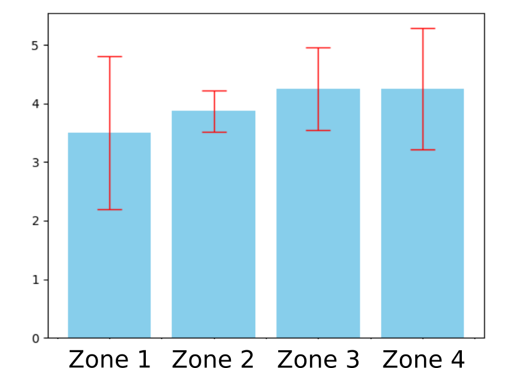
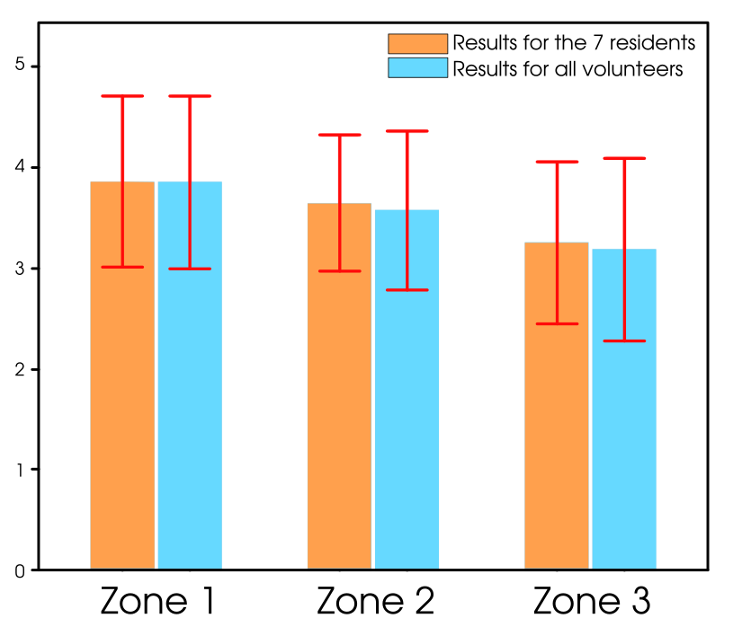

# Results of handover experiments with the Pepper robot

To check the conformity of our work and the generated zone we set up two experiments. They consists to generated different zone and realizing different transfers from the robot to the human and to evaluate the satisfaction of the receiver. This will allow us to highlight the thresholds on the indices that are the most adequate for our algorithm. The objective is the same: to test our developments with volunteers and to find an acceptable threshold combination for the object transfer.

----------
## First experimentation
### Description
The first experimentation is simple: we wanted to test our algorithms and see if the areas generated were consistent with our hypotheses. We therefore experimented with young people with no particular pathology. Four transfers are proposed and the person will have to judge each time if the transfer was acceptable by noting it on a Likert scale (on 5 levels). After having realized these four transfers, the person will have to classify them by order of preference in order to allow us to confirm the notes previously attributed in an individual way. The person will answer more open-ended questions (also accompanied by a Likert scale) in order to give their opinion on the distance to the robot, the movement of the robot or the relevance of the study.

### Transfer satisfaction
#### Answers
| Personne no. | Age | Size | weight | no.1 | no.2 | no.3 | no.4 |
|:------------:|:---:|:----:|:------:|:----:|:----:|:----:|:----:|
|      1       | 23  | 146  |   43   |  4   |  4   |  5   |  5   |
|      2       | 62  | 173  |   76   |  4   |  4   |  4   |  5   |
|      3       | 71  | 170  |   80   |  4   |  4   |  3   |  5   |
|      4       | 30  | 173  |   64   |  2   |  3   |  4   |  4   |
|      5       | 28  | 162  |   57   |  4   |  4   |  4   |  4   |
|      6       | 42  | 182  |   85   |  4   |  4   |  5   |  5   |
|      7       | 25  | 155  |   60   |  5   |  4   |  5   |  4   |
|      8       | 27  | 180  |   90   |  1   |  4   |  4   |  2   |

#### Personal ranking
| Personne no. | 1st | 2nd | 3rd | 4th |
|:------------:|:---:|:---:|:---:|:---:|
|      1       |  3  |  4  |  2  |  1  |
|      2       |  4  |  3  |  2  |  1  |
|      3       |  4  | 1,2 |  3  |     |
|      4       |  3  |  4  |  2  |  1  |
|      5       |  4  |  3  | 2,1 |     |
|      6       |  3  |  4  |  2  |  1  |
|      7       |  3  |  1  |  4  |  2  |
|      8       |  3  |  2  |  4  |  1  |

#### Average and standard deviation
|           | Average | Standard deviation |
|:---------:|:-------:|:------------------:|
|    Age    |  38.50  |       18.35        |
| Zone no.1 |  3.50   |       1.31         |
| Zone no.2 |  3.88   |       0.35         |
| Zone no.3 |  4.25   |       0.71         |
| Zone no.4 |  4.29   |       1.11         |

#### Result

  

 Histogram showing the scores, out of 5, for each area generated in the first experiment. 

### Other questions
Do you have any apprehensions about the experiment to be carried out?

| Personne no. |   1   |   2   |   3   |   4   |   5   |   6   |   7   |   8   |
|:------------:|:-----:|:-----:|:-----:|:-----:|:-----:|:-----:|:-----:|:-----:|
|              |  Non  |  Non  |  Non  |  Non  |  Non  |  Non  |  Non  |  Non  |

Were you surprised by the robot's approach to movement?

| Personne no. |   1   |   2   |   3   |   4   |   5   |   6   |   7   |   8   | Average | Standard deviation |
|:------------:|:-----:|:-----:|:-----:|:-----:|:-----:|:-----:|:-----:|:-----:|:-------:|:------------------:|
|  Note (/5)   |   4   |   4   |   5   |   2   |   5   |   2   |   4   |   4   |  3.75   |        1.16        |

Overall, how would you judge the distance between you and the robot?

| Personne no. |   1   |   2   |   3   |   4   |   5   |   6   |   7   |   8   | Average | Standard deviation |
|:------------:|:-----:|:-----:|:-----:|:-----:|:-----:|:-----:|:-----:|:-----:|:-------:|:------------------:|
|  Note (/5)   |   5   |   4   |   4   |   4   |   4   |   4   |   4   |   4   |  4.13   |        0.35        |

What do you think about the relevance of the study?

| Personne no. |   1   |   2   |   3   |   4   |   5   |   6   |   7   |   8   | Average | Standard deviation |
|:------------:|:-----:|:-----:|:-----:|:-----:|:-----:|:-----:|:-----:|:-----:|:-------:|:------------------:|
|  Note (/5)   |   5   |   5   |   5   |   5   |   5   |   4   |   5   |   4   |  4.75   |        0.46        |

----------
## Second experimentation
### Description
The second experimentation is more concrete: we retest our algorithms and especially we had the opportunity to do this directly in a nursing home room with residents. For a better estimation of the preferences, we performed this time four transfers per generated zone. This brings the number of transfers to twelve because we focus this time on only three different zones.

So, in a first step we perform 12 transfers which will allow us to find the zone preferred by the person. Then in a second step we make 4 transfers (with this chosen zone) by making the Pepper robot navigate to the edge of the bed, where the person is. This is possible thanks to the geolocation from the <cite>[ArUco][3]</cite> marker.
[3]: https://www.uco.es/investiga/grupos/ava/node/26

### Transfer satisfaction
#### Answers
| Personne no. | Age | Size | weight | tf*.1 | tf.2 | tf.3 | tf.4 | tf.5 | tf.6 | tf.7 | tf.8 | tf.9 | tf.10 | tf.11 | tf.12 |
|:------------:|:---:|:----:|:------:|:----:|:----:|:----:|:----:|:----:|:----:|:----:|:----:|:----:|:-----:|:-----:|:-----:|
|      1       | 95  | 170  |   68   |  4   |  4   |  4   |  3   |  3   |  3   |  3   |  4   |  4   |   3   |   3   |   2   |
|      2       | 96  | 162  |   54   |  4   |  4   |  4   |  4   |  4   |  4   |  4   |  4   |  4   |   4   |   4   |   4   |
|      3       | 89  | 154  |   64   |  4   |  4   |  2   |  4   |  4   |  4   |  4   |  4   |  3   |   4   |   3   |   3   |
|      4       | 83  | 163  |   53   |  4   |  3   |  4   |  2   |  4   |  4   |  3   |  2   |  1   |   3   |   4   |   2   |
|      5       | 86  | 184  |   86   |  4   |  4   |  3   |  3   |  4   |  3   |  2   |  4   |  4   |   3   |   4   |   5   |
|      6       | 99  | 164  |   52   |  3   |  4   |  4   |  4   |  5   |  2   |  3   |  5   |  4   |   4   |   3   |   5   |
|      7       | 89  | 165  |   44   |  4   |  4   |  4   |  3   |  4   |  4   |  3   |  5   |  3   |   2   |   5   |   4   |

\*tf.: transfer

#### Average and standard deviation
| Personne no. |        1        |        2        |        3        |        4        |        5        |        6        |        7        |
|:------------:|:---------------:|:---------------:|:---------------:|:---------------:|:---------------:|:---------------:|:---------------:|
|  Zone no.1   |   3.25 ± 0.96   |   4.00 ± 0.00   |   3.75 ± 0.50   |   3.00 ± 1.15   |   4.25 ± 0.50   |   4.50 ± 1.00   |   4.25 ± 0.50   |
|  Zone no.2   |   3.50 ± 0.58   |   4.00 ± 0.00   |   3.25 ± 0.96   |   3.75 ± 0.50   |   3.50 ± 0.58   |   3.25 ± 0.96   |   4.25 ± 0.50   |
|  Zone no.3   |   3.25 ± 0.50   |   4.00 ± 0.00   |   3.75 ± 0.50   |   2.25 ± 0.96   |   3.00 ± 0.82   |   3.75 ± 0.50   |   2.75 ± 0.50   |

|           | Average | Standard deviation |
|:---------:|:-------:|:------------------:|
|    Age    |  91.86  |        4.78        |
| Zone no.1 |  3.857  |        0.848       |
| Zone no.2 |  3.643  |        0.678       |
| Zone no.3 |  3.250  |        0.799       |

#### Result

  

 Histogram showing the scores, out of 5, for each area generated in the second experiment. 

### Other questions
Do you have any apprehensions about the experiment to be carried out?

| Personne no. |   1   |   2   |   3   |   4   |   5   |   6   |   7   |
|:------------:|:-----:|:-----:|:-----:|:-----:|:-----:|:-----:|:-----:|
|              |  Non  |  Oui  |  Non  |  Non  |  Non  |  Non  |  Non  |

Were you surprised by the robot's approach to movement?

| Personne no. |   1   |   2   |   3   |   4   |   5   |   6   |   7   | Average | Standard deviation |
|:------------:|:-----:|:-----:|:-----:|:-----:|:-----:|:-----:|:-----:|:-------:|:------------------:|
|  Note (/5)   |   5   |   5   |   4   |   5   |   5   |   5   |   5   |  4.86   |        1.75        |

Overall, how would you judge the distance between you and the robot?

| Personne no. |   1   |   2   |   3   |   4   |   5   |   6   |   7   | Average | Standard deviation |
|:------------:|:-----:|:-----:|:-----:|:-----:|:-----:|:-----:|:-----:|:-------:|:------------------:|
|  Note (/5)   |   5   |   5   |   4   |   5   |   4   |   3   |   4   |  4.29   |        1.67        |

What do you think about the relevance of the study?

| Personne no. |   1   |   2   |   3   |   4   |   5   |   6   |   7   | Average | Standard deviation |
|:------------:|:-----:|:-----:|:-----:|:-----:|:-----:|:-----:|:-----:|:-------:|:------------------:|
|  Note (/5)   |   3   |   4   |   3   |   3   |   4   |   3   |   3   |  3.29   |        1.25        |

### Video Available
A video can be found [here](http://bit.do/Handover-Experiment-With-The-Pepper-Robot) and summarises the whole experiment carried out in the nursing home room.

----------
## Informed Consent Statement
Informed consent was obtained from all subjects involved in the study.

##  Publication
In progress...
- **Title:** *Design of Comfortable Robot-to-Human Handovers for Assistance to Older Adults*
- **Authors:** *Jordan Nowak, Philippe Fraisse, Andrea Cherubini and Jean-Pierre Daures*

##  About authors
*Results-Of-Handover-Experiments-With-The-Pepper-Robot* was written by:
- *Jordan NOWAK* - <cite>Clinique Beau Soleil of Montpellier -- Aesio Santé -- Laboratoire d'Informatique, de Robotique et de Microélectronique de Montpellier (LIRMM) -- University of Montpellier</cite>
